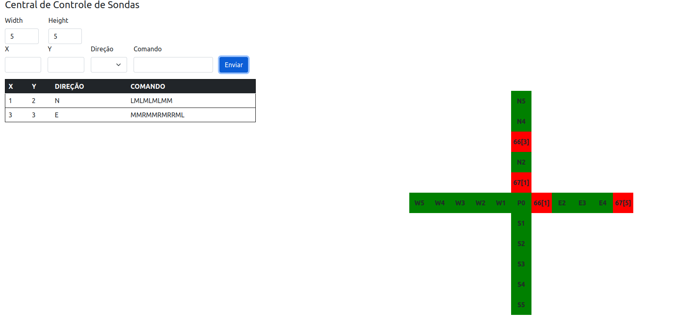

# Informações de configuração

## Requisitos obrigatórios
Desenvolvimento realizado com Java, framework Spring Boot e banco de dados MYSQL.

**Java        (11)**

**Spring Boot (2.6.4)**

**Mysql  (8.0.28)**

**JUnit  (v5.8.2)**

## Dependências (jars)
O projeto faz uso do **maven** para gerenciamento das dependências, o arquivo **pom.xml** possui todas
as dependências utilizadas com suas devidas versões.

## Configurações do Spring JPA
O BD utilizado foi **MYSQL**, crie o banco e configure os dados de acesso no arquivo **application.properties**.

## Schema BD
Dentro de **resources/bd** possui um esquema do banco utilizado, entretanto, o mesmo pode ser gerado automaticamente quando aplicação for iniciada.

Obs: As propriedades que permitem a Geração do banco, exibição de query etc...devem estar habilitadas no **application.properties**

## Teste Unitário
Estrutura de teste montada com teste de unidade, não foi implementado testes de integração. Em termos de testes resta muito código a ser implementado.

O padrão para as classes de teste é **NOME_DA_CLASSE_SERVICETest**.

## Executando o Projeto
Execute a classe **SevenMarsApplication.java**, por padrão será iniciado na porta **http://localhost:8080**, entretanto, confira no console a porta executada, uma mensagem como **Tomcat started on port(s): 8080 (http)** deve ser exibida.

## Acessando o Swagger
Após iniciar o projeto basta acessar a url **http://localhost:8080/swagger-ui.html#/**.

## Exemplo de entradas

## Observações
Criei uma página index apenas para visualizar em tela o funcionamento da posição da sonda, 
fiz com js/jquery, acredito que tenha alguns ajustes a ser feito na página para funcionar corretamente, 
está funcional, favor não considerar. 
